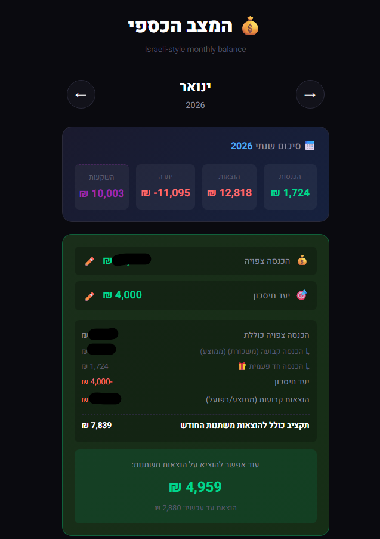

# 💰 Israeli Finance Dashboard

A self-hosted personal finance dashboard that scrapes Israeli bank accounts and credit cards, providing monthly balance tracking with Israeli-style date logic.




## ✨ Features

- **🏦 Bank Scraping** - Automatic data fetching from Israeli banks (Hapoalim, Visa Cal, Isracard)
- **📅 Israeli Month Logic** - Salary and credit card payments on the 1st-3rd count for the previous month
- **🎯 Savings Goals** - Set monthly savings targets with smart budget calculations
- **📂 Categories** - Auto-labeling of transactions with learning rules
- **📈 Investments** - Track investments separately (not counted as expenses)
- **📊 Moving Averages** - 3-month category averages with progress bars
- **💬 Comments** - Add personal notes to any transaction
- **🔒 Self-Hosted** - All data stays on your machine

## 🚀 Quick Start

### Prerequisites

- [Node.js](https://nodejs.org/) v18 or higher
- Israeli bank account credentials

### Installation

```bash
# Clone the repository
git clone https://github.com/YOUR_USERNAME/income_spending_app.git
cd income_spending_app

# Install dependencies
npm install

# Create environment file
touch .env
```

### Configuration

Create a `.env` file with your credentials:

```env
# Bank Hapoalim
HAPOALIM_USER=your_username
HAPOALIM_PASS=your_password

# Visa Cal
CAL_USER=your_username
CAL_PASS=your_password

# Isracard (optional)
ISRACARD_ID=your_id_number
ISRACARD_CARD6=last_6_digits
ISRACARD_PASS=your_password
```

### Running

```bash
# 1. Scrape bank data (opens browser for 2FA)
npm run scrape

# 2. Start the dashboard
npm start

# 3. Open http://localhost:3000
```

## 🐳 Docker

```bash
# Build and run
docker-compose up -d

# Scrape data
docker-compose run app npm run scrape

# Stop
docker-compose down
```

## 📁 Project Structure

```
income_spending_app/
├── server.js        # Express API server
├── db.js            # SQLite database layer
├── scrape.js        # Bank scraper
├── public/          # Frontend files
│   ├── index.html
│   ├── app.js
│   └── style.css
├── finance.db       # Your data (gitignored)
├── .env             # Credentials (gitignored)
└── Dockerfile       # Docker configuration
```

## 🔧 npm Scripts

| Command | Description |
|---------|-------------|
| `npm start` | Start the dashboard server |
| `npm run scrape` | Fetch transactions from banks |

## 📊 Dashboard Features

### Monthly View
- Income vs Expenses balance
- Category breakdown with moving averages
- Progress bars showing spending vs average

### Savings Calculator
- Set monthly savings target
- Expected income (manual or auto-calculated)
- Smart budget for variable expenses

### Transaction Management
- Auto-categorization rules
- Manual exclusions from balance
- Investment tracking
- Personal comments

## 🎛️ Transaction Buttons & Their Effects

Each transaction has action buttons that affect how it's counted in calculations:

### 🎁 Occasional Income Button (Income only)
Marks income as **non-recurring** (gifts, tax returns, bonuses, grandmother's money).

| Effect | Description |
|--------|-------------|
| **Expected Income** | Excluded from 3-month salary average |
| **Current Month** | Still counted in this month's income |
| **Next Month** | Won't inflate expected income predictions |

**Example:** You get ₪13,000 salary + ₪500 gift from grandma
- Mark the ₪500 as 🎁
- This month's expected income = ₪13,500 (salary average + actual gift)
- Next month's expected income = ₪13,000 (only salary average)

### 📈 Investment Button (סמן כהשקעה)
Marks a transaction as an **investment** (stocks, savings, pension contributions).

| Effect | Description |
|--------|-------------|
| **Monthly Balance** | Not counted as expense or income |
| **YTD Summary** | Tracked separately in "השקעות" |
| **Categories** | Removed from category calculations |
| **Averages** | Not included in expense averages |

**Use for:** Stock purchases, pension funds, savings deposits, crypto buys

### ⊘ Exclude Button (הוצא מחישוב היתרה)
Removes a transaction from **all balance calculations**.

| Effect | Description |
|--------|-------------|
| **Monthly Balance** | Completely excluded |
| **YTD Summary** | Completely excluded |
| **Categories** | Not counted |
| **Averages** | Not included |

**Use for:**
- Internal transfers between your own accounts
- Credit card lump sums (when you have detailed CC transactions)
- Months with incomplete data
- Duplicate transactions

**Tip:** Use "Exclude All Month" button to exclude all transactions in months where bank data is incomplete.

## 📈 Average & Budget Calculations

### Expected Income Calculation

```
Expected Income = MAX(Actual Regular Income, User Set Amount, 3-Month Average) 
                + Actual Occasional Income This Month
```

| Component | Description |
|-----------|-------------|
| **Regular Income** | Salary (excluding 🎁 marked items) |
| **3-Month Average** | Average of regular income from last 3 months |
| **User Set Amount** | Manual override (edit ✏️ button) |
| **Occasional Income** | Only actual 🎁 items received this month |

### Category Expense Averages

For each category, the app calculates a **3-month moving average** of expenses.

```
Category Average = SUM(expenses in last 3 months) / months with data
```

- Empty months are excluded from the average
- Shows as progress bar: 🟢 <80% | 🟡 80-100% | 🔴 >100%
- "הוצאות משתנות" and "ללא קטגוריה" don't show averages

### Budget for Variable Expenses

```
Available for Variables = Expected Income 
                        - Savings Goal 
                        - Fixed Expenses (MAX of actual or average per category)
```

| Step | Calculation |
|------|-------------|
| 1. Expected Income | As calculated above |
| 2. Minus Savings Goal | Your monthly target |
| 3. Minus Fixed Expenses | For each category: MAX(actual this month, 3-month average) |
| 4. = Budget for Variables | What you can spend on "הוצאות משתנות" |
| 5. Minus Already Spent | What you've spent on "הוצאות משתנות" |
| 6. = Still Available | What's left to spend |

**Why MAX(actual, average)?** To be conservative - if you already spent more than average in a category, we use the actual amount; if you spent less, we assume you'll spend the average by month end.

## 🔒 Security

- All credentials stored in `.env` (never committed)
- Data stored locally in SQLite
- No external servers - fully self-hosted
- Bank scraping uses official APIs via [israeli-bank-scrapers](https://github.com/eshaham/israeli-bank-scrapers)

## 📱 Deployment (Raspberry Pi)

```bash
# Install Docker
curl -fsSL https://get.docker.com | sh

# Copy project files and .env
scp -r income_spending_app pi@raspberrypi:~/

# Run
cd ~/income_spending_app
docker-compose up -d

# Set up auto-scraping (crontab -e)
0 8,20 * * * cd ~/income_spending_app && docker-compose run app npm run scrape
```

## 📄 License

MIT License - feel free to use and modify!

## 🙏 Credits

- [israeli-bank-scrapers](https://github.com/eshaham/israeli-bank-scrapers) - Bank scraping library
- Built with Express.js, SQLite, and vanilla JavaScript
